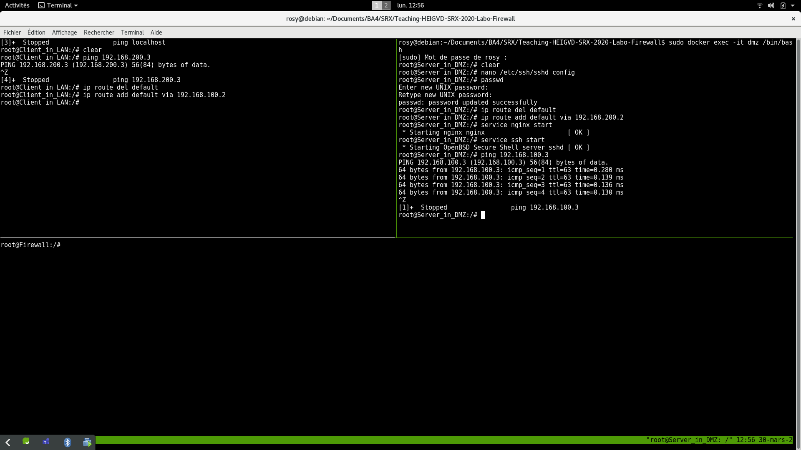
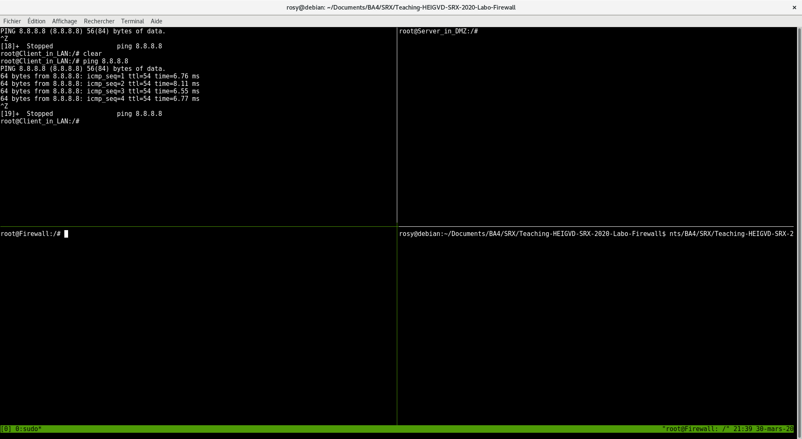

# Laboratoire 2 : firewalls

@author : Rosy-Laure Wonjamouna + ... :D

## Introduction
L’objectif principal de ce laboratoire est de familiariser les étudiants avec les pares-feu et en particulier avec netfilter et iptables. En premier, une partie théorique permet d’approfondir la rédaction de règles de filtrage.

Par la suite, la mise en pratique d’un pare-feu permettra d’approfondir la configuration et l’utilisation d’un pare-feu ainsi que la compréhension des règles.

## Règles de filtrage 

a. En suivant la méthodologie vue en classe, établir la table de filtrage avec précision en spécifiant la source et la destination, le type de trafic (TCP/UDP/ICMP/any), les ports sources et destinations ainsi que l'action désirée (**Accept** ou **Drop**, éventuellement **Reject**). 
| Adresse IP source     | Adresse IP destination | Type | Port src | Port dst  | Action |
|-----------------------|------------------------|------|----------|-----------|--------|
|(LAN) 192.168.100.0/24 | Interface WAN          | UDP  |          |    53     | ACCEPT | 1.
|Interface WAN          |(LAN) 192.168.100.0/24  | UDP  |   53     |           | ACCEPT | 1.
|(LAN) 192.168.100.0/24 | Interface WAN          | TCP  |          |    53     | ACCEPT | 1.
|Interface WAN          |(LAN) 192.168.100.0/24  | TCP  |   53     |           | ACCEPT | 1.
|(LAN) 192.168.100.0/24 | Interface WAN          | ICMP echo-request |          |           | ACCEPT | 2.
|(LAN) 192.168.100.0/24 | (DMZ) 192.168.200.0/24 | ICMP echo-request |          |           | ACCEPT | 2.
|(DMZ) 192.168.200.0/24 | (LAN) 192.168.100.0/24 | ICMP echo-request |          |           | ACCEPT | 2.
|Interface WAN          | (LAN) 192.168.100.0/24 | ICMP echo-reply |          |           | ACCEPT | 2.
|(DMZ) 192.168.200.0/24 | (LAN) 192.168.100.0/24 | ICMP echo-reply |          |           | ACCEPT | 2.
|(LAN) 192.168.100.0/24 | (DMZ) 192.168.200.0/24 | ICMP echo-reply |          |           | ACCEPT | 2.
|(LAN) 192.168.100.0/24 | Interface WAN          | TCP  |          |    80     | ACCEPT | 3.
|(LAN) 192.168.100.0/24 | Interface WAN          | TCP  |          |    8080   | ACCEPT | 3.
|Interface WAN          | (LAN) 192.168.100.0/24 | TCP  |   80     |           | ACCEPT | 3.
|Interface WAN          | (LAN) 192.168.100.0/24 | TCP  |   8080   |           | ACCEPT | 3.
|(LAN) 192.168.100.0/24 | Interface WAN          | TCP  |          |    443    | ACCEPT | 4.
|Interface WAN          | (LAN) 192.168.100.0/24 | TCP  |   443    |           | ACCEPT | 4.
|(LAN) 192.168.100.0/24 | (DMZ) 192.168.200.3    | TCP  |          |    80     | ACCEPT | 5.
|(DMZ) 192.168.200.3    | (LAN) 192.168.100.0/24 | TCP  |   80     |           | ACCEPT | 5.
|Interface WAN          | (DMZ) 192.168.200.3    | TCP  |          |    80     | ACCEPT | 5.
| (DMZ) 192.168.200.3   | Interface WAN          | TCP  |   80     |           | ACCEPT | 5.
|(LAN) 192.168.100.3    | (DMZ) 192.168.200.3    | TCP  |          |    22     | ACCEPT | 6.
|(DMZ) 192.168.200.3    | (LAN) 192.168.100.3    | TCP  |   22     |           | ACCEPT | 6.
|(LAN) 192.168.100.3    | (FW)  192.168.100.2    | TCP  |          |    22     | ACCEPT | 7.
|(FW)  192.168.100.2    | (LAN) 192.168.100.3    | TCP  |   22     |           | ACCEPT | 7.
|                       |                        | ANY  |          |           | BLOCK  | 8.

## Installation de l’environnement virtualisé

### Configuration de base

Depuis votre Client_in_LAN, essayez de faire un ping sur le Server_in_DMZ (cela ne devrait pas fonctionner !) :





## Manipulations

### Tests des connections et exemple de l'application d'une règle
a. LIVRABLE : Commandes iptables 

D'abord, on commence par setter une politique par défaut qui consiste à bloquer tout comme indiquer dans la spécification 8. à savoir : **8. Toute autre action est par défaut interdite.**
```
iptables -P INPUT DROP
iptables -P OUTPUT DROP
iptables -P FORWARD DROP
```
Ensuite, on laisse passer les pings de LAN au DMZ
```
iptables -A FORWARD -p icmp --icmp-type echo-request -s 192.168.100/24 -d 192.168.200/24 -j ACCEPT  
iptables -A FORWARD -p icmp --icmp-type echo-reply -s 192.168.200/24 -d 192.168.100/24 -j ACCEPT  
```
Puis, on laisse passer les pings de DMZ au LAN
```
iptables -A FORWARD -p icmp --icmp-type echo-request -s 192.168.200/24 -d 192.168.100/24 -j ACCEPT  
iptables -A FORWARD -p icmp --icmp-type echo-reply -s 192.168.100/24 -d 192.168.200/24 -j ACCEPT  
```
Enfin, on laisse passer les pings de LAN au WAN
```          
iptables -A FORWARD -p icmp --icmp-type echo-request -s 192.168.100/24 -o eth0 -j ACCEPT  
iptables -A FORWARD -p icmp --icmp-type echo-reply -i eth0 -d 192.168.100/24 -j ACCEPT  
```
b. Afin de tester la connexion entre le client (Client\_in\_LAN) et le WAN, tapez la commande suivante depuis le client : ping 8.8.8.8

+ Faire une capture du ping.



c. Testez ensuite toutes les règles, depuis le Client_in_LAN puis depuis le serveur Web (Server_in_DMZ) et remplir le tableau suivant : 

| De Client_in_LAN à    | OK/KO | Commentaires et explications | 
|-----------------------|-------|------------------------------------------------------------------------------------------------------|
| Interface DMZ du FW   | KO    | Cette interface appartient au firewall, de ce fait on n'est pas autorisée par les règles à la pinger.|
| Interface LAN du FW   | KO    | Même chose que pour l'interface DMZ                              |
| Client LAN            | OK    | Le client peut évidemment se pinger lui même                             |
| Serveur WAN           | OK    | On laisse passer les pings du LAN au WAN donc forcément le Client_in_LAN peut pinger le serveur WAN                            |

| De Server_in_DMZ à    | OK/KO | Commentaires et explications | 
|-----------------------|-------|------------------------------|
| Interface DMZ du FW   | KO    | Cette interface appartient au firewall, de ce fait on n'est pas autorisée par les règles à la pinger                             |
| Interface LAN du FW   | KO    | Même chose que pour l'interface DMZ                             |
| Client LAN            | OK    | On laisse passer les pings du DWZ au LAN donc forcément le Server_in_DMZ peut pinger le client LAN                               |
| Serveur WAN           | KO    | On n'est pas autorisé par les règles définies avec iptables à pinger le Serveur WAN en tant que Serveur sur la DMZ                             |

### Règles pour le protocole DNS

d. Si un ping est effectué sur un serveur externe en utilisant en argument un nom DNS, le client ne pourra pas le résoudre. Le démontrer à l'aide d'une capture, par exemple avec la commande suivante : ping www.google.com

+ Faire une capture du ping.


+ Créer et appliquer la règle adéquate pour que la condition 1 du cahier des charges soit respectée.

Pour les ports UDP:
```
iptables -A FORWARD -s 192.168.100/24 -o eth0 -p udp --dport 53 -m state --state NEW,ESTABLISHED -j ACCEPT
iptables -A FORWARD -i eth0 -d 192.168.100/24 -p udp --sport 53 -m state --state ESTABLISHED -j ACCEPT
```
Pour les ports TCP:
```
iptables -A FORWARD -s 192.168.100/24 -o eth0 -p tcp --dport 53 -m state --state NEW,ESTABLISHED -j ACCEPT
iptables -A FORWARD -i eth0 -d 192.168.100/24 -p tcp --sport 53 -m state --state ESTABLISHED -j ACCEPT
```

e. Tester en réitérant la commande ping sur le serveur de test (Google ou autre) 


f. Remarques (sur le message du premier ping)? 
Les requêtes DNS n'étant pas encore autorisées sur le firewall on a le message :
temporary failure in name resolution. En effet, on n'a pas réussir à obtenir le nom du domaine de google en lançant notre ping.


### Règles pour les protocoles HTTP et HTTPS

Créer et appliquer les règles adéquates pour que les conditions 3 et 4 du cahier des charges soient respectées. 
Pour la contrainte numero 3: Les clients du LAN doivent pouvoir ouvrir des connexions HTTP pour accéder au web
```
iptables -A FORWARD -s 192.168.100/24 -o eth0 -p tcp --dport 80 -m state --state NEW,ESTABLISHED -j ACCEPT
iptables -A FORWARD -i eth0 -d 192.168.100/24 -p tcp --sport 80 -m state --state ESTABLISHED -j ACCEPT
iptables -A FORWARD -s 192.168.100/24 -o eth0 -p tcp --dport 8080 -m state --state NEW,ESTABLISHED -j ACCEPT
iptables -A FORWARD -i eth0 -d 192.168.100/24 -p tcp --sport 8080 -m state --state ESTABLISHED -j ACCEPT
```
Pour la contrainte numero 4: Les clients du LAN doivent pouvoir ouvrir des connexions HTTPS pour accéder au web
```
iptables -A FORWARD -s 192.168.100/24 -o eth0 -p tcp --dport 443 -m state --state NEW,ESTABLISHED -j ACCEPT
iptables -A FORWARD -i eth0 -d 192.168.100/24 -p tcp --sport 443 -m state --state ESTABLISHED -j ACCEPT

```

Pour la contrainte numero 5:
Serveur web en DMZ atteignable par le LAN
```
iptables -A FORWARD -s 192.168.100/24 -d 192.168.200.3 -p tcp --dport 80 -m state --state NEW,ESTABLISHED -j ACCEPT  
iptables -A FORWARD -s 192.168.200.3 -d 192.168.100/24 -p tcp --sport 80 -m state --state ESTABLISHED -j ACCEPT    
```
Serveur web en DMZ atteignable par le WAN
```
iptables -A FORWARD -i eth0 -d 192.168.200.3 -p tcp --sport 80 -m state --state NEW,ESTABLISHED -j ACCEPT
iptables -A FORWARD -s 192.168.100/24 -o eth0 -p tcp --dport 80 -m state --state ESTABLISHED -j ACCEPT
```
g. Tester l’accès à ce serveur depuis le LAN utilisant utilisant wget (ne pas oublier les captures d'écran).


### Règles pour le protocole ssh

h. Créer et appliquer la règle adéquate pour que les **conditions 6 et 7 du cahier des charges** soient respectées.

Commandes iptables :

6. Le serveur de la DMZ peut être commandé à distance par ssh depuis votre client du LAN uniquement. Le service ssh utilise le port TCP 22.
```
iptables -A FORWARD -s 192.168.100.3 -d 192.168.200.3 -p tcp --dport 22 -m state --state NEW,ESTABLISHED -j ACCEPT  
iptables -A FORWARD -s 192.168.200.3 -d 192.168.100.3 -p tcp --sport 22 -m state --state ESTABLISHED -j ACCEPT    
```

7. Le firewall peut être configuré à distance par ssh depuis votre client du LAN uniquement.
```
iptables -A INPUT -s 192.168.100.3 -d 192.168.100.2 -p tcp --dport 22 -m state --state NEW,ESTABLISHED -j ACCEPT  
iptables -A OUTPUT -s 192.168.100.2 -d 192.168.100.3 -p tcp --sport 22 -m state --state ESTABLISHED -j ACCEPT    
```


i.  Expliquer l'utilité de **ssh** sur un serveur.

**Réponse**
Grâce à SSH on peut se connecter à distance sur une machine et y transférer des fichier si celle ci dispose d'un serveur SSH (source: linuxtricks.fr)

j. En général, à quoi faut-il particulièrement faire attention lors de l'écriture des règles du pare-feu pour ce type de connexion ?

**Réponse**
Il faut faire attention à ce que les règles du pare-feu n'autorisent **que** les utilisateurs autorisés à se connecter au serveur SSH


### Règles finales iptables

h. Insérer la capture d’écran avec toutes vos règles iptables

